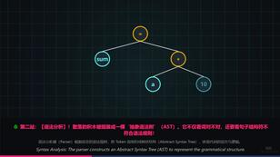
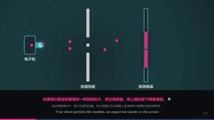
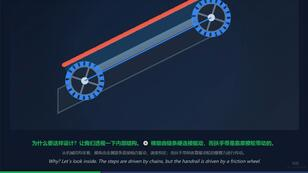
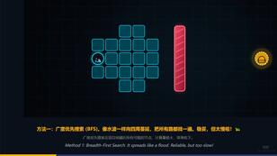
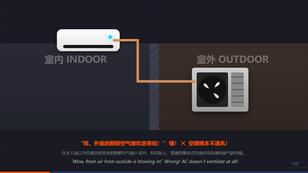

<div align="center">

<h1 style="font-size: 2.5em; font-weight: bold;"> 知搭 (ZDA)</h1>

<p style="font-size: 1.2em; font-weight: 500; margin-top: 10px;">
  <b>把转瞬即逝的念头，渲染成一个微电影大片。</b>
</p>

别再搜寻碎片，别再忍受干瘪的 AI 长文，也别再被枯燥的 PPT 模板困住。<br>
我们只专注一件事：**让知识自己长出画面、节奏和字幕，演化成一条可以被「观看」的动态链路。**

<p style="margin-top: 15px;">
  
  
  
  
</p>

<p>
  <a href="./README_EN.md">English</a> | <a href="./README.md"><b>简体中文</b></a>
</p>

<p>
  <a href="#-官网入口">在线体验</a> ·
  <a href="#-重新定义知识获取">特性一览</a> ·
  <a href="#-降维打击信息过载">痛点破局</a> ·
  <a href="#-极速本地引擎">本地部署</a> ·
  <a href="#-技术框架引导">技术框架</a> ·
  <a href="#-核心架构与-api-概览">核心架构</a>
</p>

</div>

---

## 🌐 官网入口：一键感受魔力

无需研究架构，也无需配置环境。直接打开官网，扔一个问题进去，看它如何从一句疑问，生长成一座生动的“微型知识展厅”。

<div align="center">

<a href="https://zda.cnvtn.com">
  
</a>

> **[👉 点击进入知搭官网，开启你的知识视图](https://zda.cnvtn.com)**

</div>

---

## ✨ 重新定义知识获取

**知搭，你的 AI 知识构筑师。**

试着丢给它一个脑洞或硬核问题：
* *黑洞为什么连光都逃不出去？*
* *拜占庭将军问题到底在纠结什么？*
* *为什么越拖延越觉得累？*
* *A* 算法找路为什么那么快？*

它不会甩给你一篇看似专业却令人昏昏欲睡的长篇大论。它会化身**分镜导演**，将你的问题精准拆解：先抛出什么悬念、何时该停顿、哪句话需要高亮字幕、哪一幕该切入动效。

最终交付的，是一份**沉浸式、可播放的动态视图**——不仅有丝滑的 HTML 动画、精准的时间轴与配音，还能生成专属分享链接，甚至一键录制为视频直出。

---

## 🎯 降维打击“信息过载”

在这个获取信息轻而易举的时代，“真正看懂”依然是一项反人类的挑战。搜索引擎给链接，大模型堆文字，视频平台塞碎片——结论有了，但**理解的路径断了**。

我们将枯燥的“文字堆砌”，降维打击成流畅的“视图流”：

| 传统困境 😩 | 真实感受 | 知搭方案 💡 |
| :--- | :--- | :--- |
| **收藏即吃灰** | 长文难啃，收藏=学会，截图=复习。 | **知识切片**：配合动态分镜与短字幕，将知识「喂」到嘴边。 |
| **AI 像说明书** | 满屏字干巴巴，读完大脑毫无波澜。 | **概念可视化**：让文字跃迁为有声、有画面的动态播放流。 |
| **做科普太肝** | 找素材、写脚本、剪辑配音，发际线警告。 | **工业级直出**：自动包揽脚本、时间轴、配音和画面构建。 |
| **硬核知识难啃** | 想学却找不到切入点，看两行就想放弃。 | **认知滑梯**：从问题出发，铺设一条由浅入深的顺滑路径。 |
| **黑盒式生成** | 傻等进度条，卡在哪了完全不知。 | **全透明打卡**：审查、生成、音频、组装，每步进度实时可见。 |

---

## 🚀 产物形态：动态知识视图

划重点：知搭专注的是**知识视图（Knowledge View）**。这是一种全新的内容形态：比看文章轻松，比做视频简单，比 PPT 智能，比纯文本 AI 更好分享。

它天生适合以下场景：**零基础解释新概念**、**拆解硬核科学机制**、**盘点历史因果链**、**分步图解技术原理**。

<table>
  <tr>
    <td width="306" align="center" valign="top">
      <a href="https://www.bilibili.com/video/BV1asLK65Ect/"></a>
      <br><a href="https://www.bilibili.com/video/BV1asLK65Ect/"><b>编译原理：连接人类逻辑与硅片的精密加工厂</b></a>
      <br><span>解析编译器如何将高级语言翻译为机器码，涵盖词法、语法、语义分析及代码优化全流程。</span>
    </td>
    <td width="306" align="center" valign="top">
      <a href="https://www.bilibili.com/video/BV1ZGLK6pE8D/"></a>
      <br><a href="https://www.bilibili.com/video/BV1ZGLK6pE8D/"><b>李清照：千古第一婉约才女，竟是宋朝顶级赌神</b></a>
      <br><span>李清照：千古第一婉约才女，竟是宋朝顶级赌神。</span>
    </td>
    <td width="306" align="center" valign="top">
      <a href="https://www.bilibili.com/video/BV1USLN6ME26/"></a>
      <br><a href="https://www.bilibili.com/video/BV1USLN6ME26/"><b>极光会发声？揭秘北极光背后的物理耦合奇迹</b></a>
      <br><span>极光声音源于近地面逆温层的电晕放电，而非高空极光本身。</span>
    </td>
    <td width="306" align="center" valign="top">
      <a href="https://www.bilibili.com/video/BV1mDLN6qEDn/"></a>
      <br><a href="https://www.bilibili.com/video/BV1mDLN6qEDn/"><b>双缝干涉：微观粒子的波粒二象性</b></a>
      <br><span>双缝干涉实验揭示微观粒子波粒二象性及观测导致量子态坍缩。</span>
    </td>
  </tr>
  <tr>
    <td width="306" align="center" valign="top">
      <a href="https://www.bilibili.com/video/BV1taLK6zEcE/"></a>
      <br><a href="https://www.bilibili.com/video/BV1taLK6zEcE/"><b>扶手带为何比梯级快</b></a>
      <br><span>扶手带速度略快以保障安全。</span>
    </td>
    <td width="306" align="center" valign="top">
      <a href="https://www.bilibili.com/video/BV11dLN6PE6i/"></a>
      <br><a href="https://www.bilibili.com/video/BV11dLN6PE6i/"><b>A*算法：外卖小哥如何精准找到你？</b></a>
      <br><span>A*算法通过评估实际与预估代价，高效解决城市路网最短路径问题。</span>
    </td>
    <td width="306" align="center" valign="top">
      <a href="https://www.bilibili.com/video/BV1cVLY6qExu/"></a>
      <br><a href="https://www.bilibili.com/video/BV1cVLY6qExu/"><b>空调不通风？揭秘内循环真相与换气建议</b></a>
      <br><span>解析空调内循环原理，澄清无通风功能，建议配合开窗或新风系统保持空气清新。</span>
    </td>
    <td width="306" align="center" valign="top">
      <a href="https://www.bilibili.com/video/BV1oGLK6pEoU/"></a>
      <br><a href="https://www.bilibili.com/video/BV1oGLK6pEoU/"><b>电梯按钮盲文设计原理</b></a>
      <br><span>电梯按钮盲文凸起设计原理与标准。</span>
    </td>
  </tr>
</table>

---

## 🛠️ 极速本地引擎

想在本地跑通这套生成链路？你只需准备好 MySQL、模型/TTS 配置以及运行时密钥。不留暗坑，即刻启动。

### 1. 初始化数据库
项目依赖 MySQL 8.0。请确保本地或远程服务可用：
```text
默认连接：127.0.0.1:3306/zda

```

*注：数据库 SQL 不随源码公开，需确保数据库表结构与 `app/db/models.py` 映射一致。*

### 2. 注入核心配置

项目主配置位于 `app/config.yml`。<br>为了安全，敏感密钥统一从数据库中动态读取：

```yaml
# 需在数据库中配置的核心键值
dynamic_view_model_profile.api_key: "你的模型调用密钥"
website_content.content_key: "你的运行时密钥集合" # 包含支付、邮箱、登录签名等

```

### 3. 构建运行环境

一键安装所需的全部核心依赖：

```bash
pip install fastapi uvicorn sqlalchemy pymysql pydantic pyyaml httpx python-multipart langchain-core langchain-openai openai google-genai dashscope paho-mqtt

```

### 4. 点火启动

通过 Python 模块或 Uvicorn 直接启动服务：

```bash
# 方式一：Python 模块启动
python -m app.main

# 方式二：Uvicorn ASGI 启动
uvicorn app.main:app --host 0.0.0.0 --port 5000

```

### 5. 心跳检测

服务启动后，验证健康状态：

```bash
curl [http://127.0.0.1:5000/health](http://127.0.0.1:5000/health)

```

**期望响应：**

```json
{
  "code": 200,
  "msg": "success",
  "data": {
    "status": "ok"
  }
}

```

---

## 🧭 技术框架引导

如果你不是只想“跑起来”，而是想快速理解知搭如何把模型、支付、推荐和生成链路串成一套产品，可以先从后端入口看起。项目基于 FastAPI、SQLAlchemy、MySQL 和 Pydantic 构建，`app/main.py` 负责应用生命周期、路由挂载与定时任务，`app/db/models.py` 维护核心表结构映射，`app/config.yml` 则给出本地运行时配置示例。

模型推荐与模型档位不是硬编码在前端里，而是由 `dynamic_view_model_profile` 这类运行时配置驱动，再通过 `/api/website/generation-models` 下发给页面。你可以把 `experience`、`basic`、`advanced`、`top` 理解为不同质量与成本的生成入口，每个档位都可以绑定不同模型、节点、价格与 Credit 消耗。

动态视图的主生成链路集中在 `/api/dynamic-view` 和 `app/features/dynamic_view/` 下。一次生成会被拆成主题审查、分镜脚本、HTML 组装、TTS 音频、存档与播放等阶段；前端可以轮询进度，也可以取消任务，失败或取消时会按生成状态返还对应 Credit。

支付侧已经内置 ZPAY 接入能力，入口在 `/api/payments` 与 `app/services/zpay_payment_service.py`。这条链路覆盖创建订单、订单查询、异步通知验签、通知限流、MySQL 分布式锁和会员权益发放，适合直接接到套餐购买或算力充值场景。

Credit 是知搭内部的算力结算单位，由 `app/services/credit_service.py` 统一处理。每日赠送、支付充值、兑换码、生成扣费、失败退款和过期清算都会落到账本里，方便追踪每一次模型调用到底消耗了多少额度。

官网内容推荐和展示调度分别由 `website_topic_batch_service` 与 `website_universe_service` 承担。后台会定时生成推荐话题、刷新官网主题批次，并按动态视图分类重算“大观”展示数据，让首页内容保持更新。

实时互动部分走 MQTT 与 `/api/chat`，用于讨论区初始化、会话管理、消息推送和弹幕式互动。不同环境可以通过 `mqtt.topic_prefix` 做主题隔离，避免开发、测试和线上消息互相污染。

### 模型配置建议

模型能力不写死在代码中，而是由数据库中的 `dynamic_view_model_profile` 动态控制。建议至少准备以下节点：

| 节点 | 典型职责 | 推荐配置思路 |
| :--- | :--- | :--- |
| `node1` | 主题理解、内容结构、主脚本生成 | 放置稳定、推理能力强的文本模型，优先保证结构化输出质量。 |
| `node2` | HTML/动画片段生成 | 放置代码能力更强的模型，用于把分镜转成可播放视图。 |
| `analyze` | 题目审查与意图分析 | 可使用成本较低但响应稳定的模型，降低前置判断成本。 |
| `metadata` | 摘要、标题、标签等轻量信息 | 适合配置低成本模型，提升整体吞吐。 |
| `tts` | 语音合成 | 当前链路预留 DashScope TTS 配置，按业务需要替换或扩展。 |

### 支付与权益配置

ZPAY 默认处于关闭状态，正式接入前请在 `app/config.yml` 与数据库密钥中补齐：

```yaml
zpay:
  enabled: true
  pid: "你的 ZPAY 商户 ID"
  gateway: "你的 ZPAY 网关地址"
  public_api_base_url: "你的公网 API 地址"
  plan_catalog:
    experience:
      name: 轻量补给
      money: "5.00"
      days: 1
      credit_total: 160
      model_level: experience
      priority_level: 1
```

```text
runtime_secrets.ZPAY_KEY: "你的 ZPAY 商户密钥"
```

推荐先用低金额套餐跑通“创建订单 -> 支付回调 -> 验签入账 -> Credit 发放 -> 模型扣费”全链路，再逐步开放更高模型档位。

---

## 🔌 核心架构与 API 概览

系统按业务模块进行了清晰的微服务化路由拆分：

| 路由前缀 | 模块职责 | 核心能力描述 |
| --- | --- | --- |
| `/health` | **探针** | 节点健康检查与存活确认。 |
| `/api/dynamic-view` | **引擎核心** | 创建视图生成任务、轮询进度、播放 HTML、读取音频/评论流。 |
| `/api/website` | **前台聚合** | 首页展厅配置、主题批次调度、模型选项下发、生成会话管理。 |
| `/api/auth` | **安全认证** | 身份鉴权、邮箱验证码签发与校验。 |
| `/api/payments` | **资产中枢** | ZPAY 订单创建、支付回调通知、会员权益下发、算力 Credit 结算。 |
| `/api/chat` | **实时通信** | MQTT 通道初始化、长连接会话列表管理、弹幕与消息推送。 |
| `/api/admin` | **总控后台** | 系统级资源调度与全局数据盘点。 |

---

## ⏱️ 自动化调度 (CRON)

知搭不仅仅响应前台请求，后台自带健壮的定时维保机制（多 Worker 环境下利用 MySQL `GET_LOCK` 保证分布式单例执行）：

* **僵尸任务回收**：服务启动时，自动将历史未完成的挂起任务标记为失败，拒绝前端“无限转圈”。
* **异步分发**：根据配置周期，定时从队列消费并分发视图生成任务。
* **额度重置**：每日 `00:00 (UTC+8)` 自动清算并回收过期 Credit。
* **内容焕新**：每日 `00:00 (UTC+8)` 刷新官网主题批次；每 6 小时重算大观推荐数据，保持前台内容生命力。

---

## 📄 开源许可 (License)

本项目采用 **[CC BY-NC-ND 4.0](https://creativecommons.org/licenses/by-nc-nd/4.0/)** 协议开源。
本项目仅公开源码用于学习、研究和非商业浏览。未经作者书面许可，不得用于商业用途，不得分发修改后的版本。

* **👤 署名**：必须保留“知搭 ZDA”的署名标识。
* **🚫 非商业**：严禁将本源码、产物及衍生服务用于任何商业盈利目的。
* **🔒 禁止演绎**：不得分发修改、二次封装或闭源后的版本。

---

## 📮 加入我们

在这个信息过载的时代，和我们一起重塑知识的形态。

* **📧 商务与合作**：`cnvtn@cnvtn.com`
* **🐛 漏洞与建议**：欢迎在 [GitHub Issues](https://www.google.com/search?q=%23) 中提交反馈
* **💬 开发者社区**：

  
